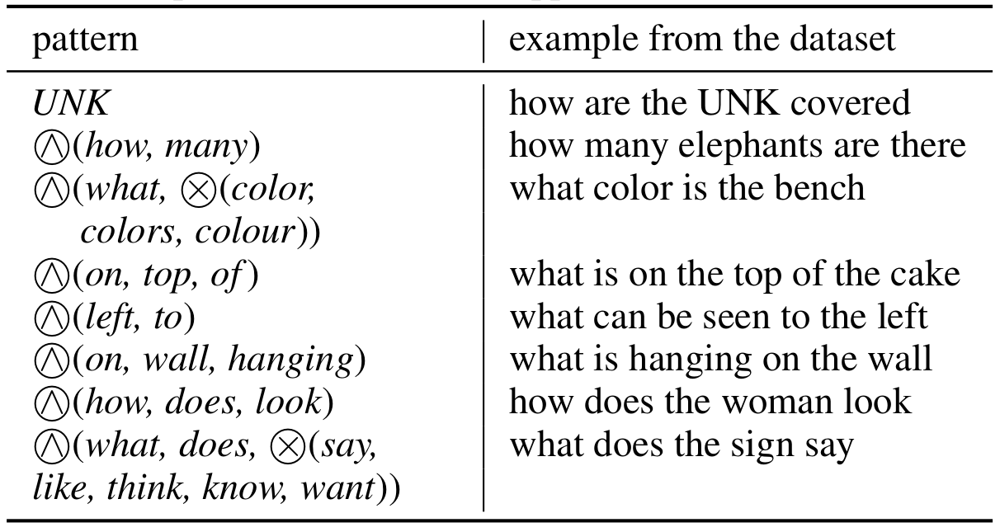

# PyPremise

PyPremise allows to easily identify patterns or explanations of where a machine learning classifier performs well 
and where it fails. It is independent of any specific classifier or architecture. It has
been evaluated both on NLP text tasks and data with arbitrary binary features. 

For a recent Visual Question Answering model, it, e.g., identifiers that the model struggles
with counting, visual orientation and higher reasoning questions:



For more examples, you can check out the original publication of [Premise](https://arxiv.org/abs/2110.09599).

## Example usage
This repository provides an easy to use interface in Python so that you can run
Premise with just a few lines of code.

```python
from pypremise import Premise, data_loaders
premise_instances, _, voc_index_to_token = data_loaders.get_dummy_data()
premise = Premise(voc_index_to_token=voc_index_to_token)
patterns = premise.find_patterns(premise_instances)
for p in patterns:
    print(p)
# prints two patterns
# (How) and (many) towards misclassification
# (When) and (was) and (taken) towards correct classification
```

If you are working on text data, you can also use word embeddings to improve the results:

```python
embedding, dim = data_loaders.create_fasttext_mapping("/path/to/fasttext.bin", voc_index_to_token)
premise = Premise(voc_index_to_token=voc_index_to_token, embedding_index_to_vector=embedding, 
                  embedding_dimensionality=dim, max_neighbor_distance=1)
patterns = premise.find_patterns(premise_instances)
# finds the additional pattern
# (When) and (was) and (taken) and (photo-or-photograph) 
```

PyPremise provides you with helper methods to load data from different sources like numpy arrays or tokenized text files.
See below for more examples.

## Installation
Install a recent version of Python, then just run
```
pip install pypremise
```
Currently, only Linux is supported. If you want to use PyPremise on Windows, just contact us.

If you want to use FastText embeddings (optional), please install them following [these instructions](https://fasttext.cc/docs/en/support.html)
and then download embeddings for your language [here](https://fasttext.cc/docs/en/crawl-vectors.html) (the .bin file is needed).

## Example Usages & Documentaiton

### General Usage

In general, you run your classifier on some data (e.g. the development set) and
log where the model predicts correctly and where it misclassifies. Then you give
this information to PyPremise and it finds patterns or misclassification and correct 
classification for you.
```
# Check if the model classifies correctly or not on your dataset
# Adapt this code to your specific setting
premise_features = [instance.x for instance in dev_set]
premise_lables = []
for instance in dev_set:
    if model.predict(instance.x) == instance.true_label:
        premise_labels.append(1) # correct classification
    else:
        premise_labels.append(0) # misclassification

# Convert your data to the PyPremise format. Various helper methods exist
# here, we use e.g. from_sparse_index_lists(). Pick the one
# for your data.
premise_instances = data_loaders.from_sparse_index_lists(premise_features, premise_labels)

# run Premise
premise_patterns = Premise().find_patterns(premise_instances)
for pattern in premise_patterns:
    print(pattern)
```

``data_loaders`` contains various methods to load data and convert it into the format
expected by PyPremise. We will now give a couple of examples. For the full documentation of the methods
and the full list of helper methods, please check the documentation in data_loaders.py.

### For NLP / for text from files

You can load the data from files. Create a file for the features and one for the labels.
Each line in the file represents one instance and the feature and the label files must
have, therefore, the same length.

In the feature file, put your text, whitespace tokenized. In the label file, put the premise 
label (0 if the instance was misclassified, 1 if it was correctly classified by your classifier). 
This could look like:

``features.txt``
```
a brown dog .
a black cat .
```

``labels.txt``
```
1
0
```
You can load this data with
```python
from pypremise import data_loaders
premise_instances, voc_token_to_index, voc_index_to_token = data_loaders.from_tokenized_file("features.txt", "labels.txt", delimiter=" ")
```
Premise works internally with indices (numbers) not tokens. You can convert from indices to tokens and vice versa with
the voc_token_to_index and voc_index_to_token. If you give the mapping to Premise, it will do the conversion of the patterns
automatically for you.

```python
from pypremise import Premise
premise = Premise(voc_index_to_token=voc_index_to_token)
```

### For NLP / for text from lists

Instead of writing the data to files, you can also use lists directly. Based
on the previous example, this would look like:

```python
features = [["a", "brown", "dog", "."], ["a", "black", "cat", "."]]
labels = [1, 0]
premise_instances, voc_token_to_index, voc_index_to_token = data_loaders.from_token_lists(features, labels)
```

The rest stays the same.

### For NLP: using FastText Word Embeddings
You can use word embeddings to get more interesting rules, like ('photo' or 'photograph' or 'picture').
For FastText embeddings, this is already implemented. Just add the FastText lookup and tell Premise to
use it. Increasing max_neighbor_distance let's it look for more complex patterns but it will also increase
the runtime.

```python
embedding, dim = data_loaders.create_fasttext_mapping("/path/to/fasttext.bin", voc_index_to_token)
premise = Premise(voc_index_to_token=voc_index_to_token, embedding_index_to_vector=embedding, 
                  embedding_dimensionality=dim, max_neighbor_distance=2)
```

### For NLP: using other Word Embeddings
You can also use any other word embeddings of your choice. You just need to provide to Premise the following:
* embedding_index_to_vector: a mapping from an index to its corresponding vector/embedding representation. You can look up the index of a token from voc_token_to_index. The embedding representation is just a list of the numbers.
* embedding_dimensionality: the dimensionality of the embedding vectors.
* max_neighbor_distance: how many neighbors to look at. A number > 0.

### For arbitrary machine learning data and data mining

PyPremise can use dense matrices and sparse matrix representations, both directly
or from files. Just check out the documentation in pypremise.data_loaders for the methods
* from_sparse_index_lists
* from_dense_index_matrix
* from_csv_sparse_index_file
* from_csv_dense_index_file


## License & Citation

If you use this tool in your work, we would be happy if you tell us about it!

Also, please cite our work as

```
@article{premise,
  author    = {Michael A. Hedderich and
               Jonas Fischer and
               Dietrich Klakow and
               Jilles Vreeken},
  title     = {Label-Descriptive Patterns and their Application to Characterizing
               Classification Errors},
  journal   = {CoRR},
  volume    = {abs/2110.09599},
  year      = {2021},
  url       = {https://arxiv.org/abs/2110.09599}
}
```

This library is published under MIT license.

## Contact and Help
If you run into any issues, feel free to contact us (email in the paper) or create an issue on GitHub. 
We are happy to help you out!
